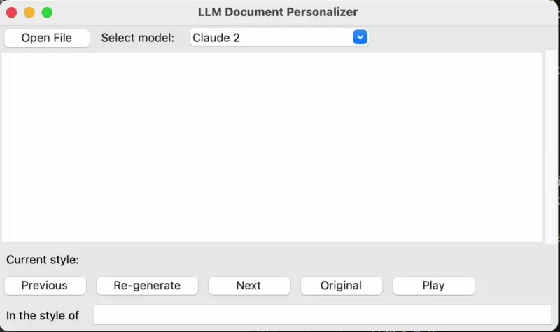

# LLM Document Personalizer



## Description

This app is a document reader (PDF and TXT) that personalizes the document to the user's preferences. 
It uses the [Claude](https://claude.ai/) API to summarize the document and the [OpenAI API](https://beta.openai.com/) to generate a personalized version of the document.

## Installation

```bash
pip install -r requirements.txt
```

## API Keys

```bash
export CLAUDE_API_KEY=XXX
# or
export OPENAI_ORG=YYY
export OPENAI_API_KEY=XXX
```

## Usage

```bash
python app.py
```